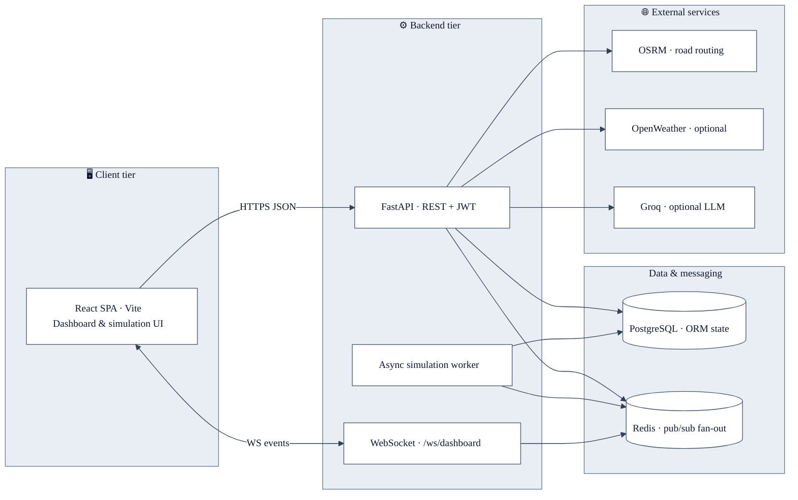
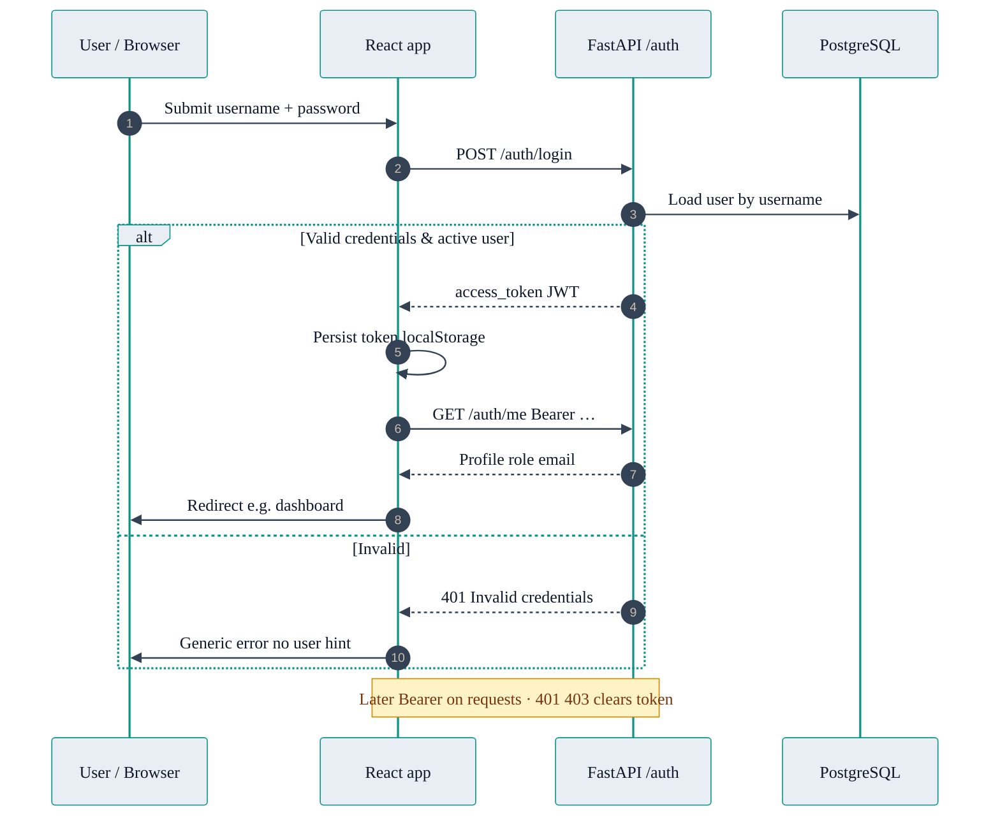
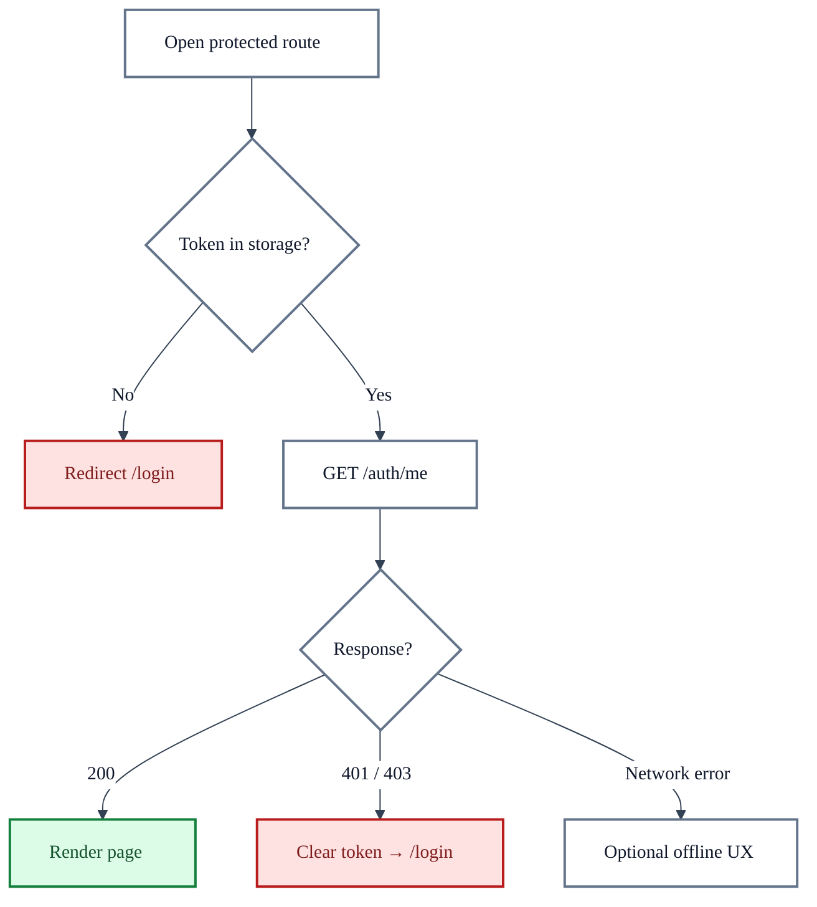
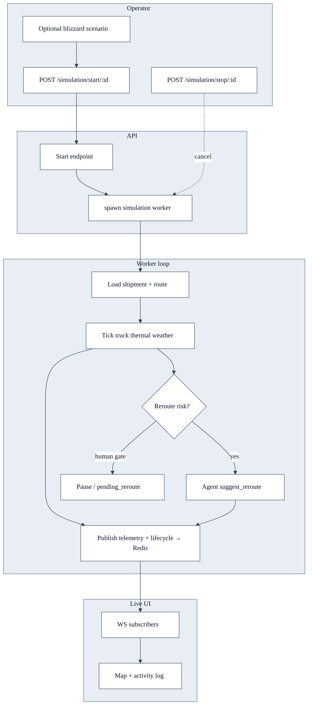
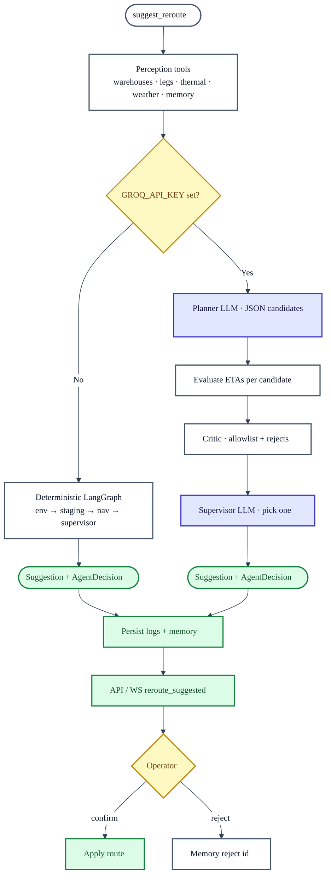
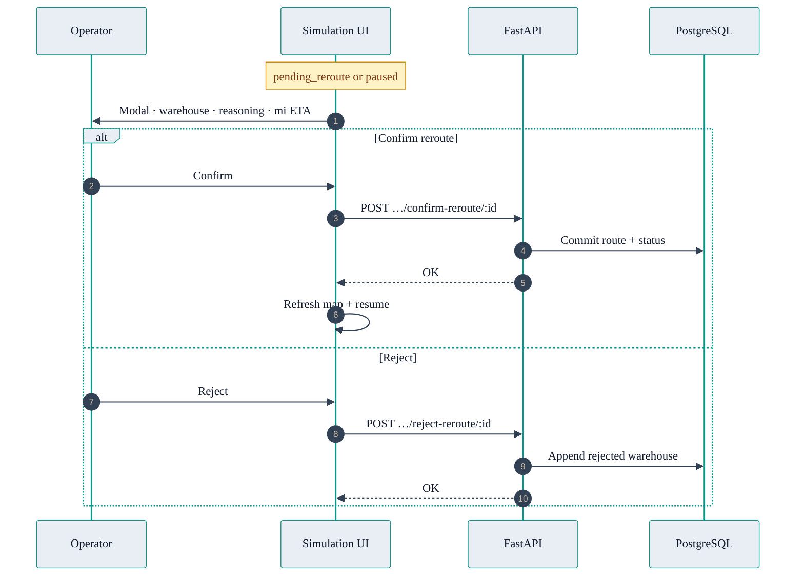

# Sentinel — architecture & behavior flowcharts

These diagrams use [Mermaid](https://mermaid.js.org/). They render on GitHub, in many IDEs, and in VS Code with a Mermaid preview extension.

**Palette (consistent across all charts):** light backgrounds (**white** `#ffffff`, **cluster** `#e8eef4`, **subtle** `#f1f5f9`) with **dark slate text** `#0f172a` for maximum contrast. **Teal** `#0d9488` is used for accents and borders only—not for large text areas. Edge and message lines use **#334155**. PNG export uses the same tokens in [`mermaid-config.json`](./mermaid-config.json).

**Export to PNG:** see [Exporting diagrams to PNG](#exporting-diagrams-to-png) at the bottom.

---

## 1. System context (who talks to whom)

High-level data flow between major components.



---

## 2. Authentication flow

From sign-in through protected API usage.





---

## 3. Simulation lifecycle (start → run → stop)

Logical flow from operator action to background processing and live UI updates.



**Telemetry vs lifecycle:** the worker publishes **telemetry** (position, temps, weather) on a schedule and **lifecycle** events (agents called, reroute suggested, blizzard entered, etc.). The dashboard WebSocket fans those out to connected clients.

---

## 4. Reroute decision (agent pipeline)

Two modes: **no Groq key** (deterministic graph) vs **Groq key set** (LLM planner + critic + supervisor). Both respect **human-in-the-loop** (no auto-apply).



---

## 5. Human-in-the-loop reroute (UI + API)



---

## 6. Shipment & routing data (simplified)

How a shipment moves from creation to simulation-ready state.

```mermaid
%%{init: {'theme':'base','themeVariables':{'fontFamily':'ui-sans-serif, system-ui, sans-serif','fontSize':'15px','primaryColor':'#ffffff','primaryTextColor':'#0f172a','primaryBorderColor':'#0d9488','secondaryColor':'#ffffff','secondaryTextColor':'#0f172a','secondaryBorderColor':'#64748b','tertiaryColor':'#f1f5f9','tertiaryTextColor':'#0f172a','tertiaryBorderColor':'#475569','lineColor':'#334155','textColor':'#0f172a','mainBkg':'#ffffff','nodeBorder':'#475569','clusterBkg':'#e8eef4','clusterBorder':'#64748b','edgeLabelBackground':'#ffffff','titleColor':'#0f172a'},'flowchart':{'curve':'basis','padding':24,'useMaxWidth':true}}}%%
flowchart LR
  classDef api fill:#ffffff,stroke:#0d9488,stroke-width:2.5px,color:#0f172a
  classDef data fill:#f1f5f9,stroke:#475569,stroke-width:2px,color:#0f172a
  classDef ext fill:#fff7ed,stroke:#c2410c,stroke-width:2px,color:#7c2d12

  A["POST /shipments"] --> B[("Shipment row")]
  B --> C["OSRM default polyline"]
  C --> D["Warehouse markers map"]
  D --> E["Simulation ticks + remaining path"]

  class A api
  class B,D,E data
  class C ext
```



---

## Related docs

- [AGENTIC_REROUTE.md](./AGENTIC_REROUTE.md) — agent tools, constraints, observability
- [API_CONTRACT.md](./API_CONTRACT.md) — REST + WebSocket summary
- [sentinel_backend_manual_simulation.md](./sentinel_backend_manual_simulation.md) — hands-on simulation steps

---

## Exporting diagrams to PNG

### Option A — npm script (recommended)

From the **`docs/`** folder:

```bash
cd docs
npm install
npm run diagrams:png
```

`npm install` runs **`postinstall`**, which tries to download **Chrome Headless Shell** for Puppeteer (~150MB). `@mermaid-js/mermaid-cli` uses **`puppeteer-core`**, which does not bundle a browser—so that step is required for PNG export.

If **`Could not find Chrome`** appears, install the browser explicitly:

```bash
cd docs
npm run diagrams:install-browser
npm run diagrams:png
```

Or in one line: **`npm run diagrams:png:all`**

PNG files are named from the **nearest `##` section title** (URL-style slug). Examples for the current doc:

| File | Section |
|------|---------|
| `system-context.png` | §1 System context |
| `authentication-flow.png` | §2 Authentication (sequence diagram) |
| `authentication-flow-2.png` | §2 Authentication (protected-route flowchart) |
| `simulation-lifecycle.png` | §3 Simulation lifecycle |
| `reroute-decision.png` | §4 Reroute decision |
| `human-in-the-loop-reroute.png` | §5 Human-in-the-loop reroute |
| `shipment-and-routing-data.png` | §6 Shipment & routing data |

Intermediate **`.mmd`** sources live in **`docs/diagrams/build/`** with the same base name.

**CI / headless servers:** set `PUPPETEER_SKIP_BROWSER_DOWNLOAD=1` before `npm install` to skip the postinstall download; install Chrome separately or use [mermaid.live](https://mermaid.live) for one-off exports.

**Optional environment variables:**

| Variable | Default | Purpose |
|----------|---------|---------|
| `MERMAID_WIDTH` | `2400` | Canvas width |
| `MERMAID_HEIGHT` | `1800` | Canvas height |
| `MERMAID_BG` | `white` | Background (`transparent` also works) |

Example:

```bash
MERMAID_WIDTH=3200 MERMAID_HEIGHT=2400 npm run diagrams:png
```

Styling for CLI output is controlled by **`docs/mermaid-config.json`**, using the same light fills, dark text (`#0f172a`), teal borders (`#0d9488`), and slate lines (`#334155`) as the inline `%%{init: …}%%` blocks above.

### Option B — one-off `npx` (no `docs/package.json` install)

```bash
cd docs
npx --yes @mermaid-js/mermaid-cli@latest -i diagrams/build/manual.mmd -o diagrams/png/out.png -c mermaid-config.json -w 2400 -H 1800 -b white
```

Create **`diagrams/build/manual.mmd`** containing a single Mermaid diagram (no markdown fence).

### Option C — Python wrapper

If you prefer Python to invoke the same CLI:

```python
import subprocess
from pathlib import Path

DOCS = Path(__file__).resolve().parent
subprocess.run(
    [
        "npx", "--yes", "@mermaid-js/mermaid-cli@latest",
        "-i", str(DOCS / "diagrams/build/manual.mmd"),
        "-o", str(DOCS / "diagrams/png/out.png"),
        "-c", str(DOCS / "mermaid-config.json"),
        "-w", "2400", "-H", "1800", "-b", "white",
    ],
    cwd=DOCS,
    check=True,
)
```

Requires **Node + npx** on `PATH`.

### Git ignore for generated assets

**`docs/.gitignore`** ignores `diagrams/build/` and `diagrams/png/` by default. Remove those lines if you want PNGs committed for coursework or slides.
