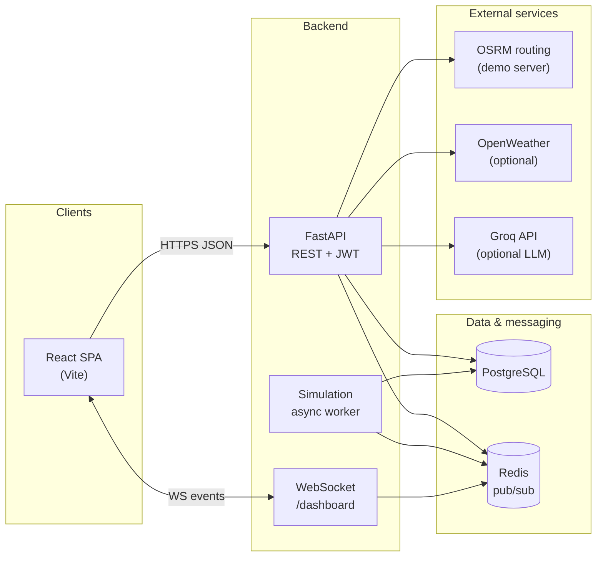
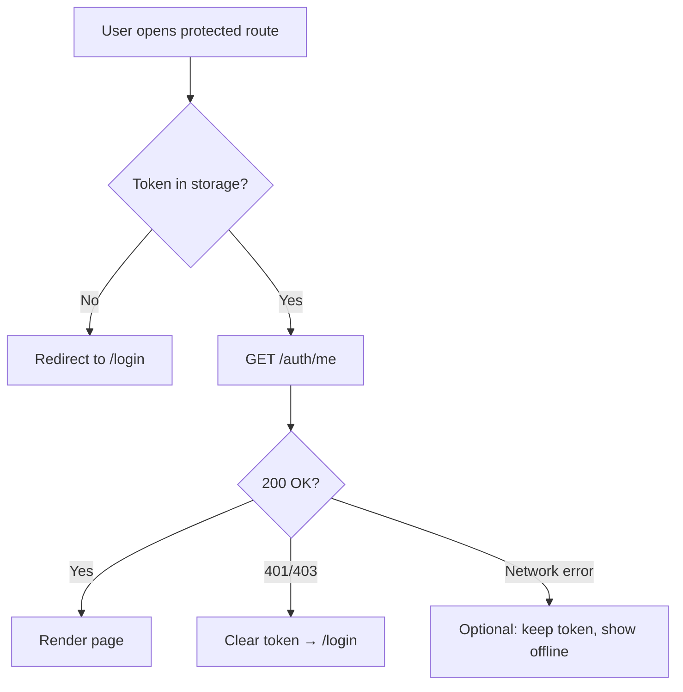
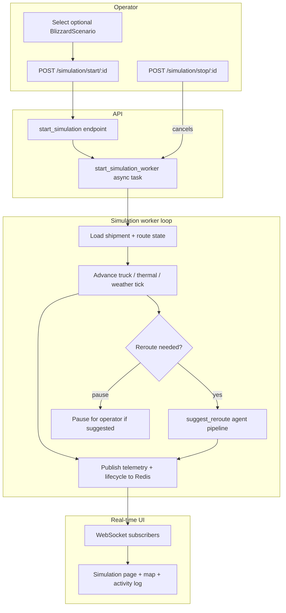
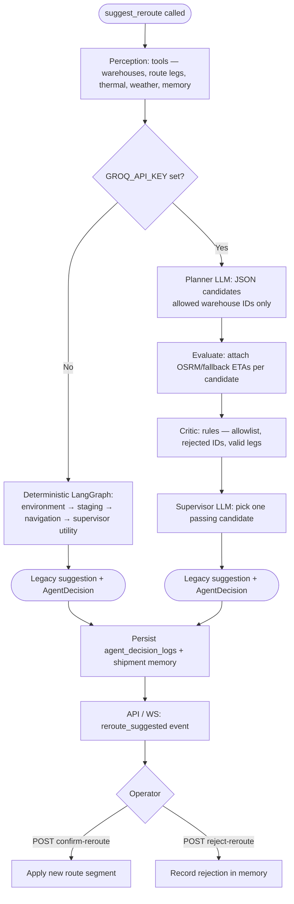
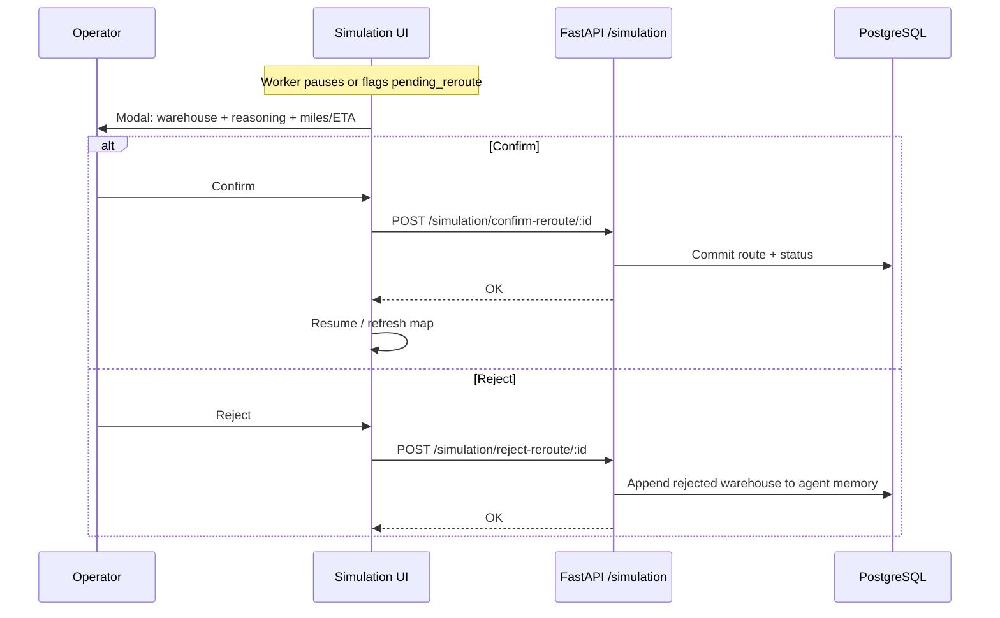
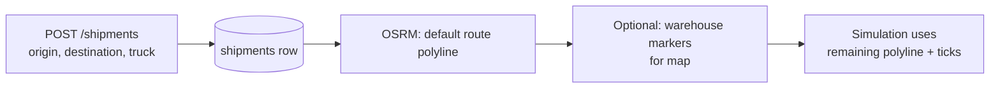

# Sentinel — architecture & behavior flowcharts

These diagrams use [Mermaid](https://mermaid.js.org/). They render on GitHub, in many IDEs, and in VS Code with a Mermaid preview extension.

---

## 1. System context (who talks to whom)

High-level data flow between major components.



---

## 2. Authentication flow

From sign-in through protected API usage.

```mermaid
sequenceDiagram
  participant U as User / Browser
  participant SPA as React app
  participant API as FastAPI /auth
  participant DB as PostgreSQL

  U->>SPA: Submit username + password
  SPA->>API: POST /auth/login
  API->>DB: Load user by username
  alt valid credentials & active user
    API-->>SPA: access_token (JWT)
    SPA->>SPA: Store token (localStorage)
    SPA->>API: GET /auth/me (Authorization: Bearer …)
    API-->>SPA: user profile (role, email)
    SPA->>U: Redirect to app (e.g. dashboard)
  else invalid
    API-->>SPA: 401 Invalid credentials
    SPA->>U: Show error (generic message)
  end

  Note over SPA,API: Later requests send Bearer token; 401/403 clears token
```



---

## 3. Simulation lifecycle (start → run → stop)

Logical flow from operator action to background processing and live UI updates.



**Telemetry vs lifecycle:** the worker publishes **telemetry** (position, temps, weather) on a schedule and **lifecycle** events (agents called, reroute suggested, blizzard entered, etc.). The dashboard WebSocket fans those out to connected clients.

---

## 4. Reroute decision (agent pipeline)

Two modes: **no Groq key** (deterministic graph) vs **Groq key set** (LLM planner + critic + supervisor). Both respect **human-in-the-loop** (no auto-apply).



---

## 5. Human-in-the-loop reroute (UI + API)



---

## 6. Shipment & routing data (simplified)

How a shipment moves from creation to simulation-ready state.



---

## Related docs

- [AGENTIC_REROUTE.md](./AGENTIC_REROUTE.md) — agent tools, constraints, observability
- [API_CONTRACT.md](./API_CONTRACT.md) — REST + WebSocket summary
- [sentinel_backend_manual_simulation.md](./sentinel_backend_manual_simulation.md) — hands-on simulation steps

To **export as PNG/SVG**, paste the Mermaid blocks into [mermaid.live](https://mermaid.live) or use the Mermaid CLI (`mmdc`).
